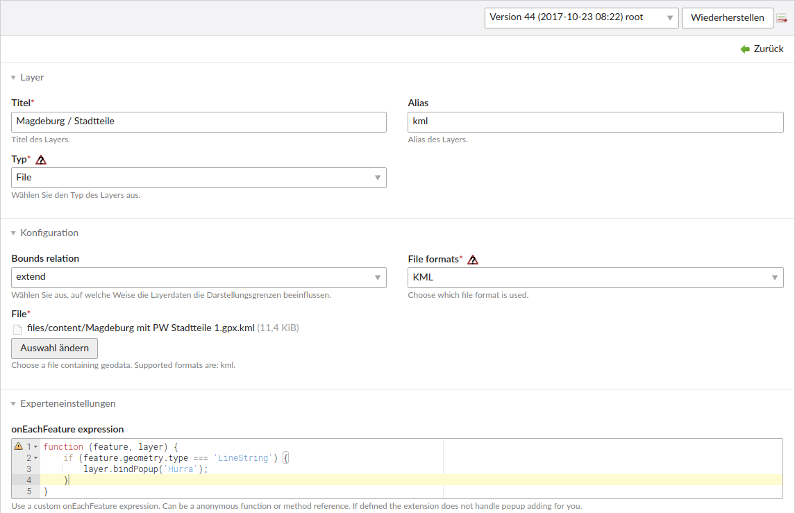

Datei-Layer
===========

Formate
-------

Leaflet für Contao unterstützt neben der Definition der Karten innerhalb von Contao auch externe Daten einzubetten. Dafür werden folgende Datenformate unterstützt:

 - GPS Exchange Format (GPX)
 - Keyhole Markup Language (KML)
 - Wellknown Text (WKT)
 - GeoJSON
 - TopoJSON
 
Die Daten werden mit Hilfe des Plugins `Omnivore`_ zu GeoJSON Features konvertiert. Unterstützt werden dabei alle Funktionen der Formate, welche die Bibliothek mit sich bringt. 
 
Datei-Layer im Backend definieren
---------------------------------

Exterene Dateien werden als Layer im Backend definiert. Externe Dateien werden grundsätzlich dynamisch mittels Ajax-Requests nachgeladen.

   Datei-Layer im Backend definieren

Mit folgenden Schritten richten Sie ein Datei-Layer ein:

 - Unter Leaflet-Layer einen neuen Layer vom Typ "Datei" (file) anlegen.
 - Entsprechendes Dateiformat auswählen
 - Datei auswählen
 - Neues Layer den gewünschten Karten zuordnen.

.. hint: Bitte achten Sie darauf, dass die entsprechenden Formate auch in den erlaubten Upload-Dateitypen definiert sind, wenn
neue Dateien hochgeladen werden sollen.

### Kartengrenzen

Als Einflussfaktor auf die Kartengrenzen (Bounds mode) steht die Option `extend` (Bounds relation) zur Verfügung. Die
Kartengrenzen werden demnach abhängig von den Daten erweitert.

### Callbacks
 
Wie gewohnt können mithilfe der `pointToLayer`_ und `onEachFeature`_ Callbacks die Darstellung der Daten beeinflusst werden.

.. _Omnivore: https://github.com/mapbox/leaflet-omnivore
.. _pointToLayer: http://leafletjs.com/examples/geojson
.. _onEachFeature: http://leafletjs.com/examples/geojson
